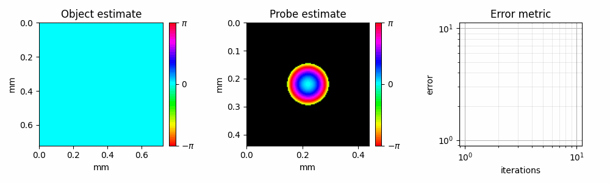

# PtyLab.py


PtyLab is an inverse modeling toolbox for Conventional (CP) and Fourier (FP) ptychography in a unified framework. For more information please check the [paper](https://opg.optica.org/oe/fulltext.cfm?uri=oe-31-9-13763&id=529026).

## Getting started

The simplest way to get started is to check the below demo in Google Colab.

[](https://colab.research.google.com/github/PtyLab/PtyLab.py/blob/main/demo.ipynb)


To explore more use cases of PtyLab, check the [example_scripts](example_scripts) and [jupyter_tutorials](jupyter_tutorials) directories. However, please install the package first as described in the below sections.

## Installation

To install the package from source,

```bash
pip install git+https://github.com/PtyLab/PtyLab.py.git
```

This package uses `cupy` to utilize GPU for faster reconstruction. Please check their [instructions](https://docs.cupy.dev/en/stable/install.html) for installing this dependency.

### Development
 
Please clone this repository and navigate to the root folder
```bash
git clone git@github.com:PtyLab/PtyLab.py.git
cd PtyLab.py
```

Inside a virtual environment (preferably with conda), please install `ptylab` and its dependencies:
```bash
conda create --name ptylab_venv python=3.11.5 # or python version satisfying ">=3.9, <3.12"
conda activate ptylab_venv
pip install -e .[dev]
```

To use the GPU, `cupy` can be additionally installed in this environment.

```bash
conda install -c conda-forge cupy
```

If you would like to contribute to this package, please checkout the [`CONTRIBUTING.md`](CONTRIBUTING.md) file.

## Citation

If you use this package in your work, cite us as below. 

```tex
@article{Loetgering:23,
        author = {Lars Loetgering and Mengqi Du and Dirk Boonzajer Flaes and Tomas Aidukas and Felix Wechsler and Daniel S. Penagos Molina and Max Rose and Antonios Pelekanidis and Wilhelm Eschen and J\"{u}rgen Hess and Thomas Wilhein and Rainer Heintzmann and Jan Rothhardt and Stefan Witte},
        journal = {Opt. Express},
        number = {9},
        pages = {13763--13797},
        publisher = {Optica Publishing Group},
        title = {PtyLab.m/py/jl: a cross-platform, open-source inverse modeling toolbox for conventional and Fourier ptychography},
        volume = {31},
        month = {Apr},
        year = {2023},
        doi = {10.1364/OE.485370},
}
```

